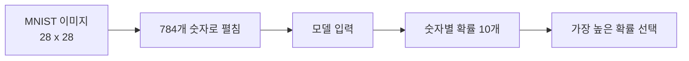
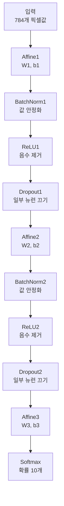
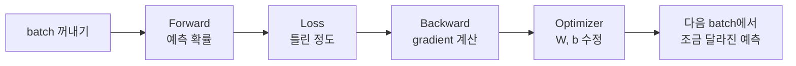
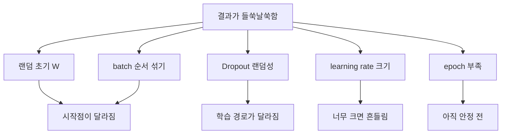

# MNIST 모델 학습 흐름 정리

이 문서는 지금 과제에서 우리가 돌리는 모델이 **이미지를 어떻게 읽고, 어떤 판단을 하고, 왜 성능이 오르내리는지**를 짧게 이어서 설명한다.

## 1. 전체 흐름

MNIST 한 장은 원래 `28 x 28` 이미지다.

코드에서는 이것을 한 줄로 펴서 `784`개 숫자로 만든다.

```text
이미지 1장
-> 28 x 28 픽셀
-> 784개 숫자
-> 모델 입력
-> 0~9 중 하나로 분류
```



각 픽셀 값은 `0~255`가 아니라 `0~1` 사이 값으로 바뀐다.

```python
x_train = data["x_train"].astype(np.float32).reshape(-1, 784) / 255.0
```

이렇게 하는 이유는 값의 크기를 작게 맞춰서 학습이 덜 흔들리게 하기 위해서다.

## 2. 모델이 하는 일

모델은 이미지를 보고 바로 숫자를 맞히는 것이 아니다.

중간 계산을 여러 번 거친 뒤 마지막에 확률을 만든다.

현재 구조는 대략 이 흐름이다.

```text
입력 784개
-> Affine1
-> BatchNorm1
-> ReLU1
-> Dropout1
-> Affine2
-> BatchNorm2
-> ReLU2
-> Dropout2
-> Affine3
-> Softmax
-> 숫자별 확률 10개
```



마지막 출력 예시는 이런 느낌이다.

```text
[0.01, 0.02, 0.03, 0.01, 0.04, 0.02, 0.01, 0.82, 0.03, 0.01]
```

여기서는 `7` 위치의 확률이 가장 크므로 모델은 이 이미지를 `7`이라고 판단한다.

## 3. 각 부품의 역할

### Affine

`Affine`은 입력값과 가중치 `W`, 편향 `b`를 이용해 다음 값으로 바꾼다.

```text
x -> xW + b
```

쉽게 말하면, 이미지 픽셀들을 조합해서 다음 층으로 넘길 특징을 만든다.

학습에서 실제로 바뀌는 핵심 값은 이 `W`, `b`다.

### ReLU

`ReLU`는 음수 값을 `0`으로 막고, 양수 값은 그대로 보낸다.

```text
음수 -> 0
양수 -> 그대로
```

역할은 모델이 단순한 직선 계산만 하지 않게 만드는 것이다.

ReLU가 없으면 Affine을 여러 번 쌓아도 표현력이 약해진다.

### Softmax

`Softmax`는 마지막 점수 10개를 확률처럼 바꾼다.

```text
숫자별 점수 10개
-> 숫자별 확률 10개
```

그래서 `0~9` 중 어느 숫자를 가장 그럴듯하게 보는지 알 수 있다.

### Cross Entropy Loss

`loss`는 모델이 얼마나 틀렸는지 나타내는 값이다.

```text
정답 확률이 높다 -> loss 낮음
정답 확률이 낮다 -> loss 높음
```

학습의 목표는 이 loss를 낮추는 것이다.

### Optimizer

`SGD`나 `Adam`은 계산된 gradient를 보고 `W`, `b`를 실제로 바꾼다.

```text
loss 계산
-> gradient 계산
-> optimizer가 W, b 수정
-> 다음 예측이 조금 달라짐
```

즉, optimizer가 없으면 loss는 계산할 수 있지만 모델은 배워지지 않는다.

## 4. 학습 한 번의 순서

`train()` 함수 안에서 한 batch는 이렇게 처리된다.

```text
1. x_batch, y_batch를 꺼낸다.
2. model.forward(x_batch)로 예측 확률을 만든다.
3. cross_entropy_loss로 얼마나 틀렸는지 계산한다.
4. y_pred에서 정답 위치만 1을 빼서 gradient 시작값을 만든다.
5. model.backward(dout)으로 각 W, b의 gradient를 구한다.
6. optimizer.update(model.params, model.grads)로 W, b를 수정한다.
7. batch loss를 기록한다.
```



이 과정을 모든 batch에 대해 반복하면 `1 epoch`이다.

```text
1 epoch = 학습 데이터 전체를 한 번 다 본 것
```

## 5. 지금 실험 옵션의 의미

### SGD

가장 단순한 업데이트 방식이다.

```text
W = W - lr * gradient
```

장점은 이해하기 쉽다는 것이다.

단점은 learning rate에 민감하고 Adam보다 느릴 수 있다는 것이다.

### Adam

Adam도 optimizer다.

SGD처럼 `W`, `b`를 바꾸지만, 이전 gradient 흐름까지 참고해서 더 안정적으로 움직인다.

보통 같은 조건이면 Adam이 loss를 더 빨리 낮추는 경우가 많다.

### He

He는 처음 `W`를 어떤 크기의 랜덤값으로 시작할지 정하는 방법이다.

현재 코드에서는 He를 사용한다.

```python
np.random.randn(...) * np.sqrt(2.0 / input_size)
```

ReLU와 잘 맞는다.

He가 없으면 학습이 가능은 하지만 시작점이 덜 좋아져서 loss가 느리게 내려가거나 정확도가 낮을 수 있다.

### Xavier

Xavier도 초기화 방법이다.

현재 코드는 Xavier를 사용하지 않는다.

Xavier는 보통 Sigmoid, Tanh 계열과 더 자주 묶인다.

ReLU를 쓰는 지금 구조에서는 He가 더 자연스럽다.

### BatchNorm

BatchNorm은 중간 값들을 너무 크거나 작지 않게 정리한다.

```text
중간 계산값 안정화
-> gradient 안정화
-> 학습이 덜 흔들림
```

끄면 학습은 되지만 loss가 더 흔들리거나 속도가 느릴 수 있다.

### Dropout

Dropout은 학습 중 일부 뉴런을 랜덤으로 꺼버린다.

```text
일부 뉴런 끄기
-> 특정 뉴런에만 의존하지 않게 만들기
-> 과적합 줄이기
```

하지만 Dropout은 일부러 랜덤성을 넣는 기능이다.

그래서 켜면 학습 중 loss나 정확도가 더 흔들릴 수 있다.

MNIST에서는 Dropout이 없어도 성능이 잘 나올 수 있다.

## 6. 왜 결과가 들쑥날쑥할까

성능이 매번 똑같이 나오지 않는 이유는 정상적인 요소가 많다.



### 1. 처음 W가 랜덤이다

모델은 처음부터 똑같은 머리로 시작하지 않는다.

`W1`, `W2`, `W3`가 랜덤으로 만들어진다.

시작점이 달라지면 학습 경로도 달라진다.

### 2. batch 순서를 매 epoch 섞는다

`train()`에서 데이터를 섞는다.

```python
indices = np.random.permutation(train_size)
```

순서가 달라지면 같은 데이터라도 업데이트 순서가 달라진다.

그래서 loss와 accuracy가 조금씩 달라질 수 있다.

### 3. Dropout은 랜덤으로 뉴런을 끈다

Dropout을 켜면 학습할 때마다 일부 뉴런이 꺼진다.

그래서 같은 이미지라도 학습 중에는 통과하는 길이 매번 조금 달라진다.

### 4. learning rate가 크면 흔들린다

`lr`은 한 번에 얼마나 크게 움직일지 정한다.

```text
lr이 너무 작다 -> 천천히 배움
lr이 너무 크다 -> loss가 오르내리며 흔들림
```

SGD는 특히 `lr` 영향을 크게 받는다.

### 5. epoch가 적으면 아직 안정되지 않았다

1~2 epoch만 보면 운 좋게 높거나 낮게 보일 수 있다.

실험 비교는 보통 여러 epoch의 흐름을 봐야 한다.

## 7. 실험은 이렇게 나누면 된다

한 번에 여러 옵션을 바꾸면 원인을 모른다.

항상 하나만 바꿔야 한다.

### 기준 모델

```text
ReLU + Softmax + Adam + He + BatchNorm
```

### 비교 1: Optimizer

```text
Adam vs SGD
```

보고 싶은 것:

```text
누가 loss를 더 빠르게 낮추는가
누가 accuracy를 더 안정적으로 올리는가
```

### 비교 2: BatchNorm

```text
BatchNorm 있음 vs 없음
```

보고 싶은 것:

```text
loss가 덜 흔들리는가
accuracy가 더 빨리 올라가는가
```

### 비교 3: Dropout

```text
Dropout 있음 vs 없음
```

보고 싶은 것:

```text
학습 정확도는 낮아질 수 있음
테스트 정확도는 더 안정될 수 있음
너무 강하면 둘 다 낮아질 수 있음
```

### 비교 4: He

```text
He 있음 vs 일반 랜덤 초기화
```

보고 싶은 것:

```text
초반 loss가 잘 내려가는가
ReLU와 함께 쓸 때 정확도가 더 잘 나오는가
```

## 8. 결과를 읽는 법

accuracy 하나만 보고 판단하면 헷갈린다.

같이 봐야 하는 것은 세 가지다.

```text
train loss
train accuracy
test accuracy
```

해석은 이렇게 한다.

```text
train loss 내려감, test accuracy 올라감
-> 정상적으로 학습 중

train accuracy 높음, test accuracy 낮음
-> 과적합 가능성

loss가 계속 흔들림
-> lr이 크거나 Dropout 영향 가능성

loss가 거의 안 내려감
-> lr이 너무 작거나 초기화/gradient 문제 가능성
```

## 9. 지금 코드 기준으로 기억할 것

현재 코드에서 중요한 선택지는 이렇다.

```text
optimizer = SGD(...)
-> SGD 사용

optimizer = Adam(...)
-> Adam 사용

NeuralNetwork(use_batchnorm=True)
-> BatchNorm 사용

NeuralNetwork(use_batchnorm=False)
-> BatchNorm 사용 안 함

NeuralNetwork(use_dropout=True)
-> Dropout 사용

NeuralNetwork(use_dropout=False)
-> Dropout 사용 안 함
```

He는 현재 `network.py` 안에 직접 들어가 있다.

그래서 옵션으로 끄는 구조가 아니라 코드를 바꿔야 한다.

```text
He 사용:
np.sqrt(2.0 / input_size)

He 제거:
0.01 같은 작은 랜덤값 사용
```

## 10. 결론

이 모델은 이미지를 바로 맞히는 것이 아니다.

픽셀값을 여러 층으로 통과시키면서 숫자별 확률을 만들고, 정답과 비교해서 loss를 구하고, optimizer가 `W`, `b`를 고치면서 점점 맞히는 방향으로 간다.

성능이 들쑥날쑥한 것은 대부분 다음 때문이다.

```text
랜덤 초기값
batch 순서 섞기
Dropout 랜덤성
learning rate
epoch 부족
```

그래서 실험할 때는 한 번에 하나만 바꾸고, accuracy 한 번의 숫자보다 loss와 accuracy의 흐름을 같이 봐야 한다.
