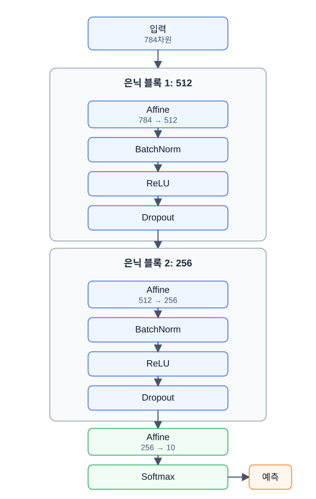
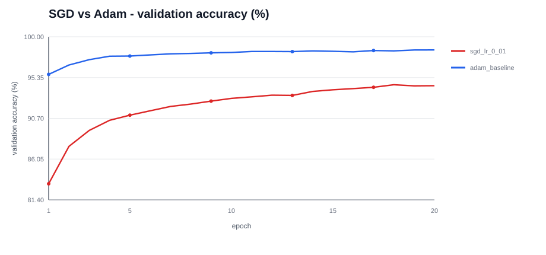
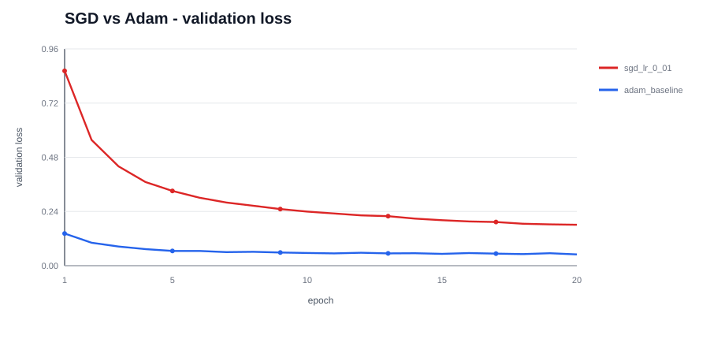
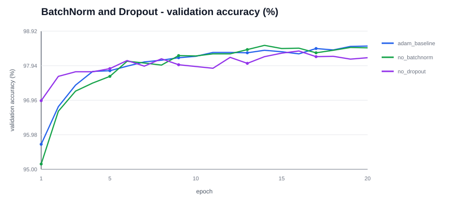
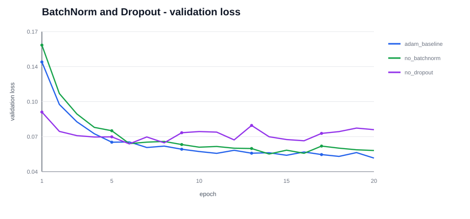
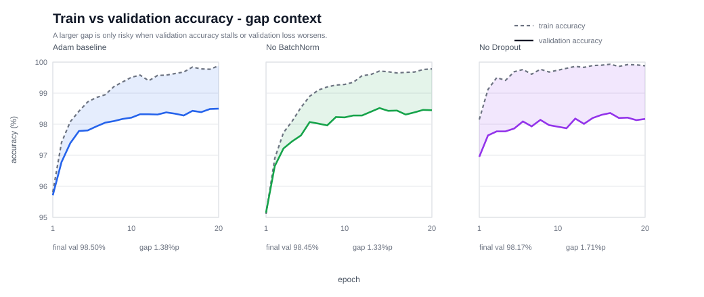
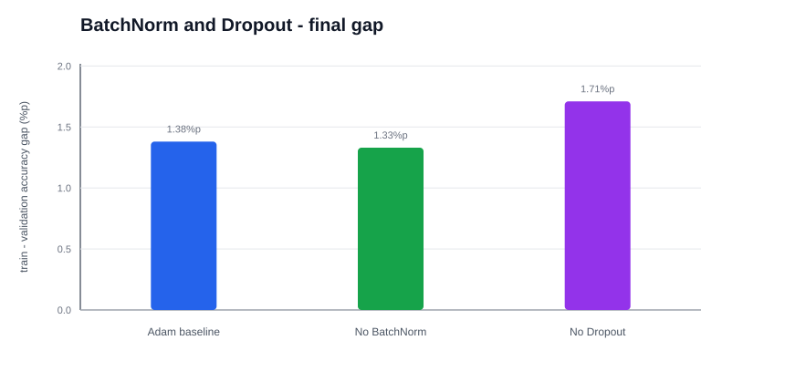
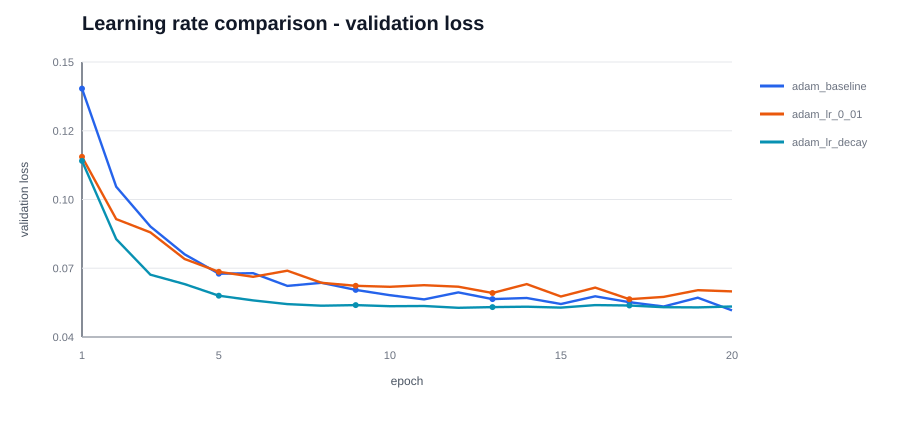
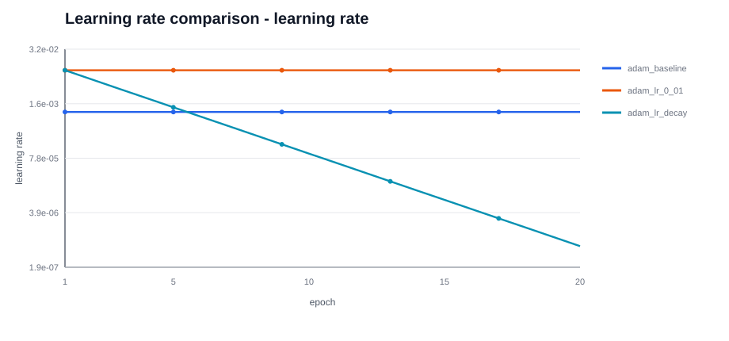

# MNIST 전략 비교 실험 보고서

## 0. 반·팀원

| 항목 | 내용                 |
| --- |--------------------|
| **반** | 302 5팀             |
| **팀원** | 양시준, 이재혁, 이정현, 황선호 |

---

## 1. 프로젝트 요약

MNIST 10개 클래스 분류를 **NumPy만으로 구현한 신경망**으로 수행하고, 학습 과정에서 가장 높은 결과를 보인 `adam_baseline`을 기준으로 다른 선택지를 사용했을 때 어떤 차이가 생기는지 비교했습니다. 모든 실험에서 **ReLU 활성화 함수와 He 초기화는 고정**했고, 최적화 방법, BatchNorm, Dropout, 학습률만 바꿨습니다.

| 핵심 항목 | 결과 |
| --- | --- |
| 목표 | MNIST 검증/테스트 정확도 97% 이상 |
| 비교 기준 | `adam_baseline` |
| 기준 모델 최종 검증 정확도 | **98.50%** |
| 총 실험 수 | 6회 |
| 공통 모델 크기 | BatchNorm 사용 기준 537,354개 파라미터 |

실험의 목적은 단순히 가장 높은 숫자를 찾는 것이 아니라, 기준 조건에서 다른 선택지로 바꿨을 때 결과가 어떻게 달라지는지 확인하는 것이었습니다. 또한 그 결과가 수업에서 학습한 내용과 맞게 해석되는지도 함께 확인했습니다. 최고 정확도만 보면 `no_batchnorm`이 98.52%로 가장 높았지만, `adam_baseline`과의 차이는 반복 실행에서 생길 수 있는 표준편차 수준으로 볼 수 있습니다. 따라서 이 차이만으로 BatchNorm 제거가 더 좋다고 판단하기보다는, 검증 손실과 훈련-검증 차이를 함께 비교했습니다.

---

## 2. 모델 구조

기본 모델은 28x28 이미지를 784차원 벡터로 펼친 뒤, 두 개의 은닉층과 하나의 출력층을 통과하는 완전연결 신경망입니다. 비교 전략에 따라 BatchNorm과 Dropout을 끄는 경우가 있지만, 기본 구조는 다음과 같습니다.

| 구분 | 내용 |
| --- | --- |
| **입력** | 784차원 벡터 (28x28 픽셀, 0~1 정규화) |
| **은닉층 1** | Affine(784 → 512) → BatchNorm → ReLU → Dropout |
| **은닉층 2** | Affine(512 → 256) → BatchNorm → ReLU → Dropout |
| **출력층** | Affine(256 → 10) → Softmax |
| **손실 함수** | 교차 엔트로피 손실 |
| **고정 조건** | ReLU, He 초기화 |

  

파라미터 수는 Affine 계층이 535,818개이고, BatchNorm을 켜면 gamma/beta 1,536개가 추가되어 총 537,354개가 됩니다. Dropout, ReLU, Softmax는 학습 파라미터를 갖지 않습니다.

---

## 3. 학습 설정 및 기록 방식

공통 학습 설정은 다음과 같습니다.

| 항목 | 값 |
| --- | --- |
| 에포크(epoch) | 20 |
| 배치 크기 | 128 |
| 훈련 지표 측정 | 고정 훈련 데이터 일부 10,000개 |
| 검증/테스트 지표 측정 | 전체 `x_test`, `y_test` |
| 시드 | 42 |
| Dropout 비율 | 0.5 |
| BatchNorm 모멘텀 | 0.9 |
| 초기화 | He |

비교한 실험은 총 6회입니다. 이 중 `adam_baseline`은 학습 과정에서 가장 높은 결과를 보인 기준 조건으로 두고, 나머지 실험은 기준 조건에서 한 가지 선택지를 바꿨을 때의 차이를 확인하는 방식으로 구성했습니다.

| 전략 | 비교 그룹 | 최적화 방법 | 학습률 | 학습률 조정 | BatchNorm | Dropout | 파라미터 수 |
| --- | --- | --- | ---: | --- | --- | --- | ---: |
| `adam_baseline` | 공통 기준 | Adam | 0.001 | 없음 | 사용 | 사용 | 537,354 |
| `sgd_lr_0_01` | SGD와 Adam | SGD | 0.01 | 없음 | 사용 | 사용 | 537,354 |
| `no_batchnorm` | BatchNorm 유무 | Adam | 0.001 | 없음 | 미사용 | 사용 | 535,818 |
| `no_dropout` | Dropout 유무 | Adam | 0.001 | 없음 | 사용 | 미사용 | 537,354 |
| `adam_lr_0_01` | 학습률 비교 | Adam | 0.01 | 없음 | 사용 | 사용 | 537,354 |
| `adam_lr_decay` | 학습률 비교 | Adam | 0.01 시작 | 에포크(epoch)마다 `0.6`배 | 사용 | 사용 | 537,354 |

실행은 Google Colab에서 `mnist_lab_for_test.ipynb`의 비교 실험 셀로 수행했습니다. 로컬에서는 학습을 실행하지 않았고, Colab에서 생성된 결과 파일을 저장소로 옮겼습니다.

| 파일 | 내용 |
| --- | --- |
| `experiment_logs/grouped_strategy_run_20260527-115521.txt` | 사람이 읽을 수 있는 전체 에포크(epoch) 로그 |
| `experiment_logs/grouped_strategy_run_20260527-115521.csv` | 전략, 에포크(epoch), 학습률, 손실, 정확도, 파라미터 수 등 구조화 로그 |
| `experiment_logs/grouped_strategy_summary_20260527-115521.md` | 전체 비교 수치표 |
| `report_assets/*.svg` | 리포트에 붙일 그룹별 비교 그래프 |

---

## 4. 전체 결과

전체 비교는 그래프 없이 수치표로 정리했습니다.

| 전략 | 최적화 방법 | 최종 검증 정확도 | 최고 검증 정확도 | 최고 에포크(epoch) | 훈련 정확도 | 검증 손실 | 최종 학습률 | 파라미터 수 | BN | Dropout |
| --- | --- | ---: | ---: | ---: | ---: | ---: | ---: | ---: | --- | --- |
| `adam_baseline` | Adam | 98.50% | 98.50% | 20 | 99.88% | 0.0499 | 0.001000 | 537,354 | 사용 | 사용 |
| `sgd_lr_0_01` | SGD | 94.42% | 94.53% | 18 | 94.62% | 0.1812 | 0.010000 | 537,354 | 사용 | 사용 |
| `no_batchnorm` | Adam | 98.45% | 98.52% | 14 | 99.78% | 0.0572 | 0.001000 | 535,818 | 미사용 | 사용 |
| `no_dropout` | Adam | 98.17% | 98.36% | 16 | 99.88% | 0.0773 | 0.001000 | 537,354 | 사용 | 미사용 |
| `adam_lr_0_01` | Adam | 98.31% | 98.38% | 18 | 99.71% | 0.0578 | 0.010000 | 537,354 | 사용 | 사용 |
| `adam_lr_decay` | Adam | 98.37% | 98.41% | 12 | 99.54% | 0.0515 | 0.000001 | 537,354 | 사용 | 사용 |

`adam_baseline`은 최종 검증 정확도 98.50%로 기준 조건 중 가장 안정적인 결과를 보였습니다. `no_batchnorm`의 최고 검증 정확도는 98.52%로 가장 높았지만, 기준 모델과의 차이는 반복 실행에서 생길 수 있는 표준편차 수준으로 볼 수 있습니다. 가장 큰 차이는 최적화 방법 비교에서 나타났고, Adam이 SGD보다 20 에포크(epoch) 안에서 훨씬 빠르게 수렴했습니다. 반면 Adam 기반 실험들 사이의 정확도 차이는 대부분 작았기 때문에, 검증 손실과 훈련-검증 차이까지 함께 고려했습니다.

---

## 5. 비교 실험

비교 실험은 `adam_baseline`을 기준으로 두고, 학습 결과에 영향을 줄 가능성이 큰 요소를 하나씩 바꿔 확인하는 방식으로 구성했습니다. 이를 통해 결과 차이가 실제로 최적화 방법, 정규화, Dropout, 학습률 선택에서 나온 것인지 해석하고자 했습니다.

| 비교 항목 | 비교 대상 | 확인하려는 점 |
| --- | --- | --- |
| 최적화 방법 | SGD와 Adam | 같은 구조에서 어떤 최적화 방법이 20 에포크(epoch) 안에 더 빠르게 수렴하는지 |
| BatchNorm | BatchNorm 사용/미사용 | BatchNorm이 정확도와 검증 손실 안정성에 주는 영향 |
| Dropout | Dropout 사용/미사용 | Dropout이 훈련-검증 차이와 검증 손실에 주는 영향 |
| 학습률 | 0.001, 0.01, 감소 방식 | 학습률 크기와 감소 전략이 최종 정확도와 일반화 차이에 주는 영향 |

모든 비교에서 ReLU와 He 초기화는 고정했습니다. 따라서 아래 실험은 모델의 기본 표현력 차이보다 최적화 방법, 정규화, 학습률 설정의 차이를 보는 데 초점을 둡니다. 각 결과는 단순 수치 비교에 그치지 않고, 학습한 개념과 맞는 방향으로 결과가 나왔는지 함께 해석했습니다.

### 5.1 SGD와 Adam 비교

**조건**

| 전략 | 최적화 방법 | 학습률 | BatchNorm | Dropout | 비교 목적 |
| --- | --- | ---: | --- | --- | --- |
| `sgd_lr_0_01` | SGD | 0.01 | 사용 | 사용 | SGD 수렴 속도 확인 |
| `adam_baseline` | Adam | 0.001 | 사용 | 사용 | 기준 최적화 방법 |

모델 구조, ReLU, He 초기화, BatchNorm, Dropout은 모두 같게 두고 최적화 방법만 바꿨습니다. SGD는 학습률 0.01, Adam은 학습률 0.001로 실험했습니다.

**현상**

Adam은 초반부터 검증 정확도가 빠르게 올라갔습니다. 반면 SGD는 학습은 진행됐지만 20 에포크(epoch) 안에서는 상승 속도가 느렸습니다. SGD의 훈련-검증 차이는 작았지만, 이는 일반화가 잘됐다기보다는 전체 학습이 아직 덜 된 상태에 가깝습니다.

  

  

**결과**

Adam은 최종 검증 정확도 98.50%를 기록했고, SGD는 94.42%에 머물렀습니다. 같은 에포크(epoch) 수 안에서는 Adam이 훨씬 빠르게 수렴했습니다. SGD 학습률 0.01은 학습 자체는 진행됐지만, 20 에포크(epoch) 기준으로 목표 정확도 97%에 도달하지 못했습니다.

---

### 5.2 BatchNorm, Dropout 유무 비교

**조건**

| 전략 | 최적화 방법 | 학습률 | BatchNorm | Dropout | 비교 목적 |
| --- | --- | ---: | --- | --- | --- |
| `adam_baseline` | Adam | 0.001 | 사용 | 사용 | 기준 조건 |
| `no_batchnorm` | Adam | 0.001 | 미사용 | 사용 | BatchNorm 제거 영향 확인 |
| `no_dropout` | Adam | 0.001 | 사용 | 미사용 | Dropout 제거 영향 확인 |

Adam, 학습률 0.001, ReLU, He 초기화는 고정했습니다. 기준 모델은 BatchNorm과 Dropout을 모두 켰고, 비교 실험에서는 각각 BatchNorm만 끄거나 Dropout만 껐습니다.

**현상**

BatchNorm을 끈 경우 정확도 차이는 크지 않았지만 검증 손실이 기준 모델보다 높았습니다. Dropout을 끈 경우 훈련 정확도는 매우 빠르게 올라갔고 거의 100%에 가까워졌습니다. 하지만 검증 손실이 가장 높았고, 훈련-검증 차이도 빠르게 커졌습니다.

  

  

  

  

**결과**

BatchNorm 제거는 단일 정확도만 보면 큰 차이가 없었지만, 손실 기준으로는 기준 모델보다 덜 안정적이었습니다. Dropout 제거는 학습 데이터에 더 빠르게 맞춰졌지만, 검증 손실이 높고 최종 검증 정확도가 낮아 기준 모델보다 일반화 지표가 덜 좋았습니다.

Dropout 비교는 차이 자체보다 **차이가 커지는 속도, 검증 손실, 검증 정확도 최고점**을 함께 봐야 합니다. Dropout 미사용 조건에서는 훈련 정확도가 빠르게 포화되고 차이도 빠르게 커졌지만, 이 현상만으로 모델이 나쁘다고 판단하기는 어렵습니다. 다만 Dropout 사용 조건이 검증 손실과 최종 정확도에서 더 나은 값을 보였기 때문에, 이번 실험에서는 Dropout을 켠 기준 모델이 일반화 지표 측면에서 더 안정적이었다고 해석했습니다.

---

### 5.3 학습률 비교

**조건**

| 전략 | 최적화 방법 | 학습률 설정 | BatchNorm | Dropout | 비교 목적 |
| --- | --- | --- | --- | --- | --- |
| `adam_baseline` | Adam | 0.001 고정 | 사용 | 사용 | 기준 학습률 |
| `adam_lr_0_01` | Adam | 0.01 고정 | 사용 | 사용 | 큰 학습률 영향 확인 |
| `adam_lr_decay` | Adam | 0.01 시작 후 에포크(epoch)마다 0.6배 | 사용 | 사용 | 큰 학습률로 시작 후 감소 |

Adam, ReLU, He 초기화, BatchNorm, Dropout은 모두 고정했습니다. 학습률만 0.001 고정, 0.01 고정, 0.01에서 시작해 감소시키는 방식으로 비교했습니다.

**현상**

학습률 0.01은 초반 학습은 빠르게 진행됐지만 후반 검증 손실이 기준 모델보다 높았습니다. 학습률 0.001은 전체적으로 안정적으로 학습되었고 최종 검증 정확도가 가장 높았습니다. 학습률 감소 방식은 큰 학습률로 시작한 뒤 점점 줄어들면서, 최종 정확도는 기준보다 약간 낮았지만 훈련-검증 차이는 더 작았습니다.

  

  

  

**결과**

정확도만 보면 Adam 학습률 0.001 기준 모델이 가장 좋은 선택이었습니다. 하지만 일반화 안정성까지 보면 학습률 감소 방식도 의미 있는 선택지였습니다. 학습률 0.01 고정은 너무 큰 학습률을 끝까지 유지해서 최종 손실과 정확도가 기준 모델보다 좋지 않았습니다.

---

## 6. 종합 결론

이번 실험의 결론은 다음과 같습니다.

| 관점 | 결론 |
| --- | --- |
| 최적화 방법 | Adam이 SGD보다 20 에포크(epoch) 안에서 훨씬 빠르게 수렴했습니다. |
| BatchNorm | 제거해도 정확도 손실은 작았지만 검증 손실은 기준 모델보다 높았습니다. |
| Dropout | 미사용 조건에서는 훈련 정확도가 빠르게 포화되고 차이가 커졌지만, 사용 조건이 검증 손실과 최종 정확도에서 더 안정적이었습니다. |
| 학습률 | 정확도 단일 기준은 Adam 학습률 0.001 기준 모델이 가장 높았고, 일반화 안정성 기준은 학습률 감소 방식이 더 나았습니다. |
| 기준 조건 | `Adam(학습률=0.001) + BatchNorm 사용 + Dropout 사용 + He 초기화` |

`adam_baseline`은 최종 검증 정확도 기준으로 가장 높은 결과를 냈고, 다른 선택지와의 비교 기준으로 사용하기에 적절했습니다. 다만 학습률 감소 방식은 정확도가 0.13%p 낮았지만 훈련-검증 차이가 더 작았기 때문에 일반화 안정성 측면에서 의미 있는 대안으로 볼 수 있습니다. 전체적으로 실험 결과는 학습한 내용과 대체로 일치했습니다. Adam은 SGD보다 빠르게 수렴했고, Dropout을 제거하면 훈련-검증 차이와 검증 손실이 커졌으며, 학습률 설정은 최종 정확도와 일반화 차이에 모두 영향을 주었습니다.
