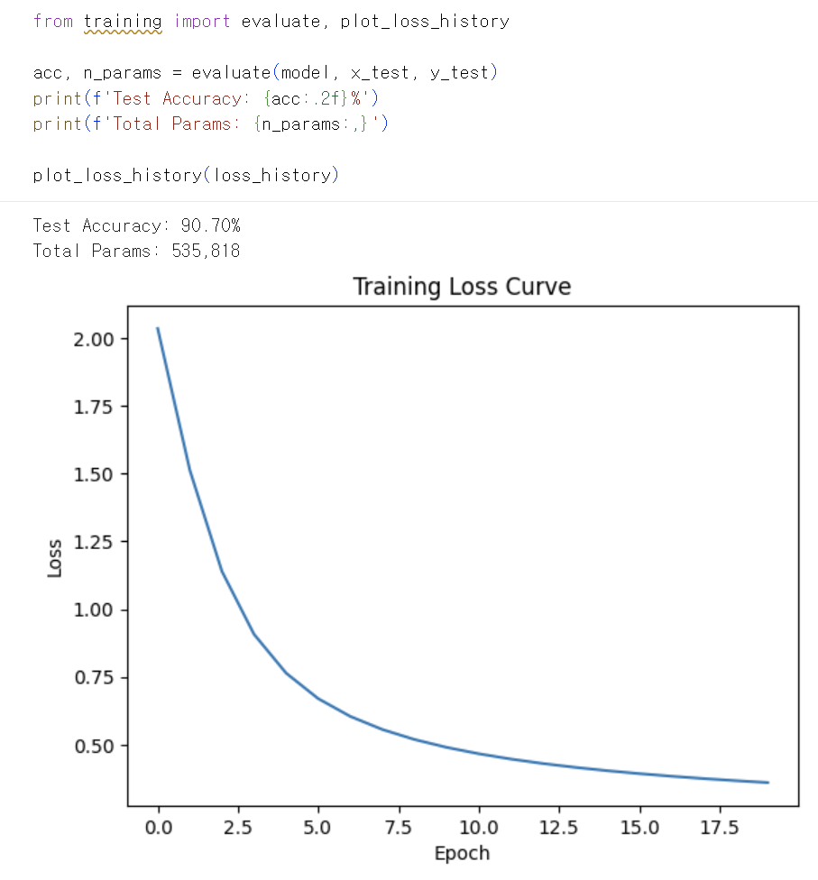
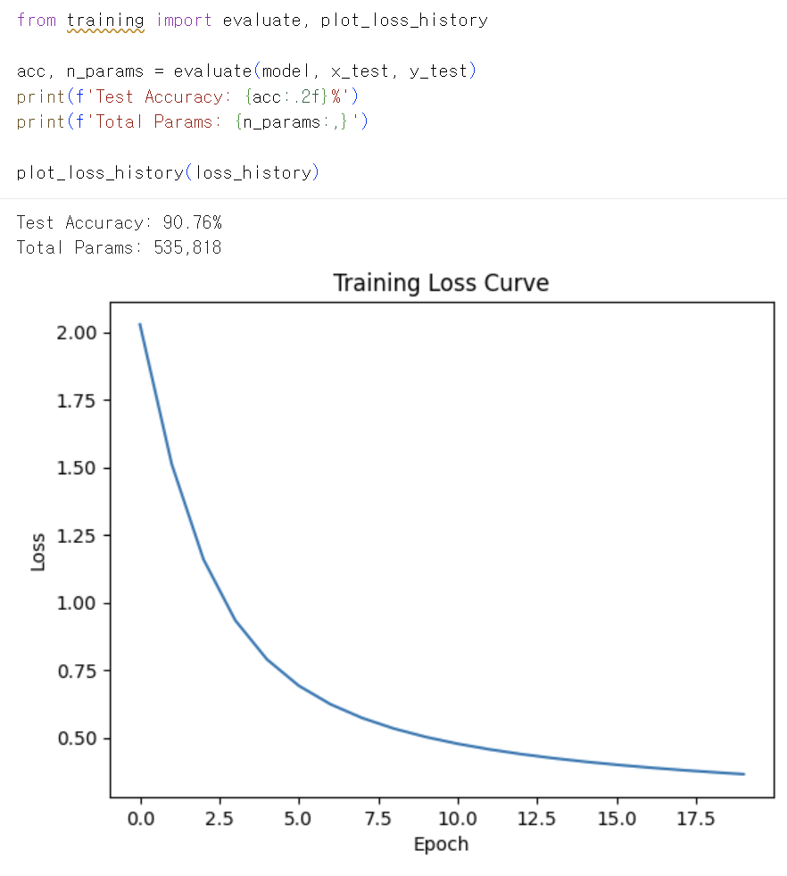
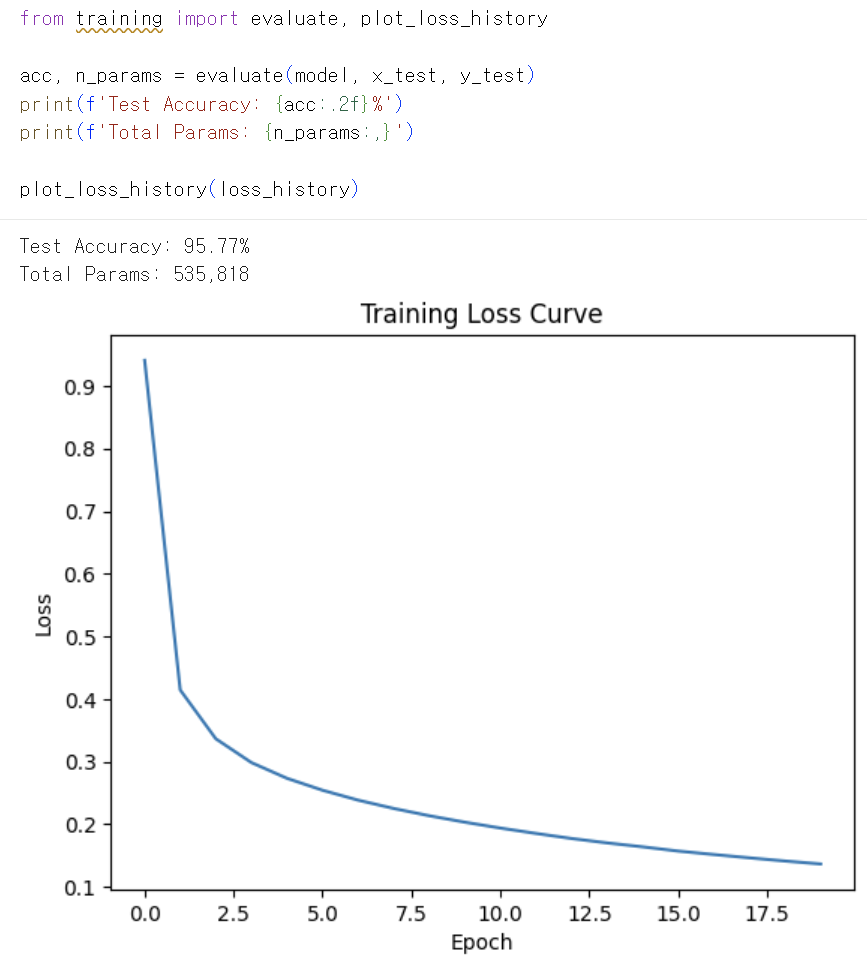
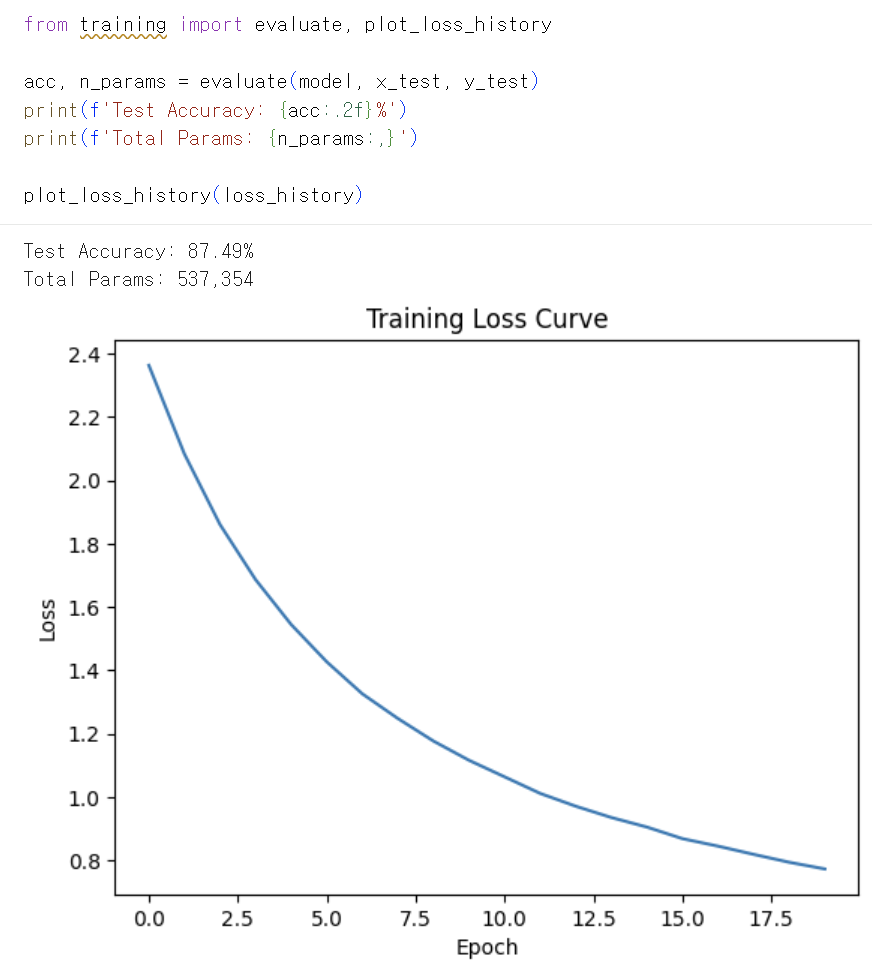
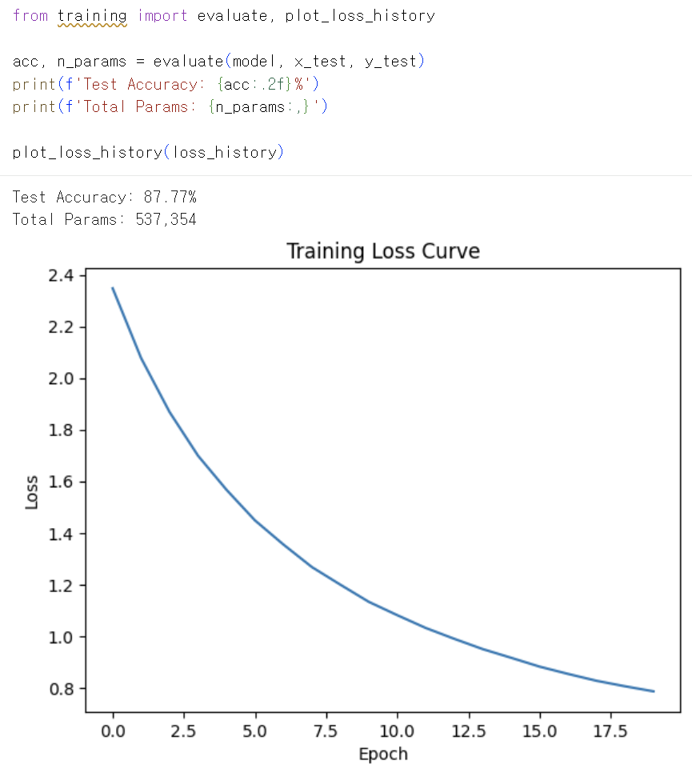
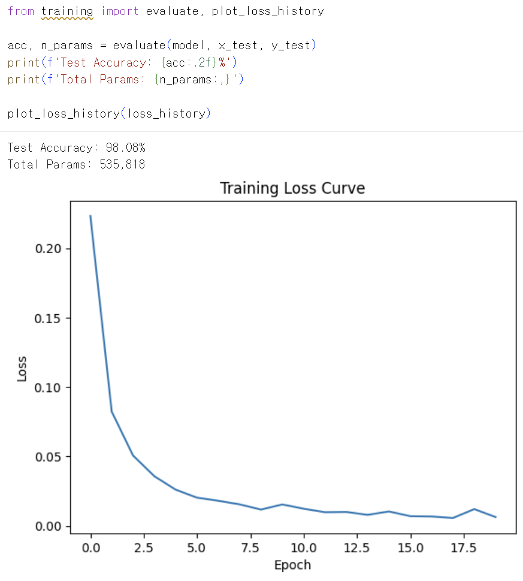
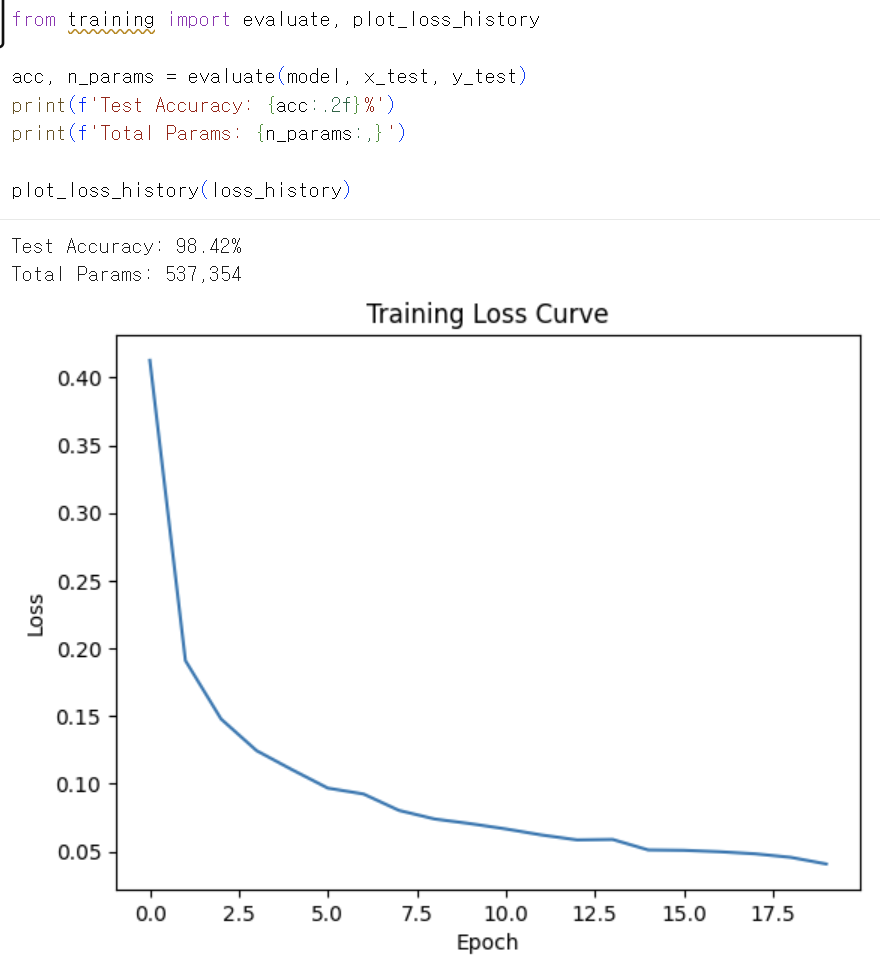
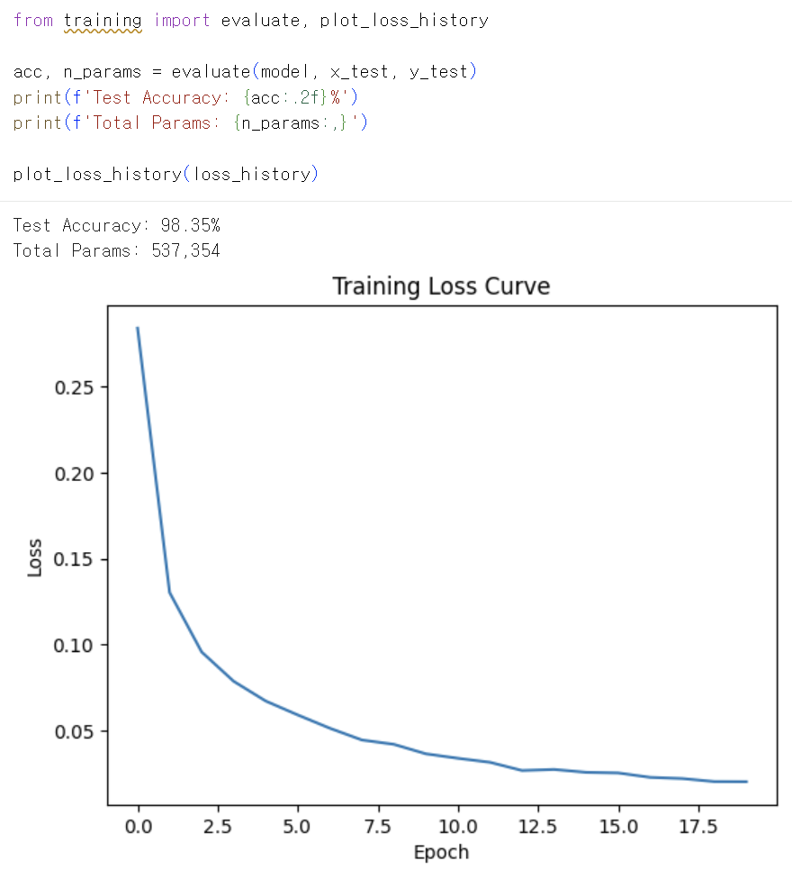

# MNIST 손글씨 인식 과제 보고서

## 0. 반·팀원

| 항목 | 내용 |
| --- | --- |
| 반 | 302 |
| 팀원 | 양시준 |
| 팀원 | 이정현 |
| 팀원 | 황선호 |
| 팀원 | 이재혁 |


---

## 1. 실험 목적

본 과제의 목표는 PyTorch나 TensorFlow 같은 딥러닝 프레임워크 없이, `NumPy`만 사용하여 MNIST 손글씨 숫자 분류 신경망을 직접 구현하는 것이다.

MNIST 이미지는 `28 x 28` 픽셀을 펼친 `784`차원 입력이며, 모델은 각 이미지를 `0`부터 `9`까지의 숫자 중 하나로 분류한다.

이번 실험에서는 단순히 높은 정확도를 얻는 것뿐 아니라, 다음 흐름을 직접 구현하고 이해하는 것을 목표로 했다.

```text
Forward -> Loss 계산 -> Backward -> Optimizer Update -> Evaluate
```

특히 `SGD`와 `Adam`, `learning rate`, `BatchNorm`, `Dropout`, 가중치 초기화 방식이 학습 결과에 어떤 영향을 주는지 비교했다.

---

## 2. 모델 구조

기본 모델은 `784 -> 512 -> 256 -> 10` 구조의 다층 퍼셉트론이다.

| 구분 | 내용 |
| --- | --- |
| 입력층 | `784`차원 입력, MNIST `28 x 28` 이미지를 1차원으로 펼친 값 |
| 은닉층 1 | `Affine(784, 512)` |
| 은닉층 2 | `Affine(512, 256)` |
| 출력층 | `Affine(256, 10)` |
| 활성화 함수 | 은닉층은 `ReLU`, 출력층은 `Softmax` |
| 정규화 | 실험에 따라 `BatchNorm` 사용 여부 변경 |
| 규제 | 실험에 따라 `Dropout` 사용 여부와 비율 변경 |
| 손실 함수 | Cross Entropy Loss |

BatchNorm과 Dropout을 사용하는 경우의 전체 구조는 다음과 같다.

```text
Input(784)
-> Affine(512)
-> BatchNorm
-> ReLU
-> Dropout
-> Affine(256)
-> BatchNorm
-> ReLU
-> Dropout
-> Affine(10)
-> Softmax
```

BatchNorm과 Dropout을 사용하지 않는 실험에서는 은닉층이 다음처럼 단순화된다.

```text
Input(784)
-> Affine(512)
-> ReLU
-> Affine(256)
-> ReLU
-> Affine(10)
-> Softmax
```

---

## 3. 학습 설정

공통 학습 조건은 다음과 같다.

| 항목 | 값 |
| --- | --- |
| 데이터셋 | MNIST |
| 입력 크기 | `784` |
| 출력 클래스 | `10` |
| epochs | `20` |
| batch size | `128` |
| 활성화 함수 | `ReLU`, `Softmax` |
| 손실 함수 | Cross Entropy Loss |
| 가중치 초기화 | He, Xavier, Random(no scaling) 비교 |
| 실행 방식 | Colab에서 학습 및 평가 |

실험한 주요 조합은 다음과 같다.

### SGD 실험 조건

| 번호 | Optimizer | BatchNorm | Dropout | Learning Rate | 초기화 | Test Accuracy | Total Params |
| --- | --- | --- | --- | --- | --- | --- | --- |
| 1 | SGD | False | False | 0.001 | He | 90.70% | 535,818 |
| 2 | SGD | False | False | 0.001 | Xavier | 90.76% | 535,818 |
| 3 | SGD | False | False | 0.01 | He | 95.77% | 535,818 |
| 4 | SGD | True | True | 0.001 | He | 87.49% | 537,354 |
| 5 | SGD | True | True | 0.001 | Random(no scaling) | 87.77% | 537,354 |

### Adam 실험 조건

| 번호 | Optimizer | BatchNorm | Dropout | Dropout Ratio | 초기화 | Test Accuracy | Total Params |
| --- | --- | --- | --- | --- | --- | --- | --- |
| 1 | Adam | False | False | 0.5 | He | 98.08% | 535,818 |
| 2 | Adam | True | True | 0.5 | He | 98.42% | 537,354 |
| 3 | Adam | True | True | 0.3 | He | 98.35% | 537,354 |

---

## 4. 실험 환경

| 항목 | 내용 |
| --- | --- |
| 언어 | Python 3.11 권장 환경 |
| 주요 라이브러리 | NumPy, Matplotlib |
| 실행 환경 | Google Colab |
| 학습 장치 | Colab CPU/GPU 런타임 |
| 학습 시간 | 4분. 각 실험은 `20 epochs`, `batch size 128` 기준으로 실행 |

---

## 5. 결과

### 5.1 전체 결과 요약

가장 높은 정확도는 `Adam + BatchNorm True + Dropout True + ratio=0.5 + He` 조합에서 나왔고, test accuracy는 `98.42%`였다.

| 구분 | 최고 조합 | Test Accuracy | Total Params |
| --- | --- | --- | --- |
| SGD 최고 결과 | SGD, lr=0.01, BatchNorm False, Dropout False, He | 95.77% | 535,818 |
| Adam 최고 결과 | Adam, BatchNorm True, Dropout True, ratio=0.5, He | 98.42% | 537,354 |

SGD에서는 learning rate 변화가 가장 큰 영향을 주었다. `lr=0.001`에서는 90% 수준에 머물렀지만, `lr=0.01`에서는 95.77%까지 상승했다.

Adam은 모든 실험에서 98% 이상의 정확도를 보였고, SGD보다 빠르고 안정적으로 수렴했다.

---

### 5.2 SGD 실험 결과

#### SGD 1. BatchNorm False, Dropout False, lr=0.001, He

학습 loss는 꾸준히 감소했지만, learning rate가 작아 20 epoch 안에서 충분히 빠르게 수렴하지 못했다.



#### SGD 2. BatchNorm False, Dropout False, lr=0.001, Xavier

He 초기화와 비교했을 때 정확도 차이는 거의 없었다. 현재 모델이 아주 깊지 않고 MNIST 데이터셋이 비교적 단순하기 때문에 초기화 방식 차이가 크게 드러나지 않은 것으로 보인다.



#### SGD 3. BatchNorm False, Dropout False, lr=0.01, He

learning rate를 `0.001`에서 `0.01`로 높이자 loss가 더 빠르게 감소했고, 정확도도 `95.77%`까지 상승했다. SGD 실험 중 가장 좋은 결과다.



#### SGD 4. BatchNorm True, Dropout True, lr=0.001, He

BatchNorm과 Dropout을 추가했지만 정확도는 오히려 낮아졌다. 낮은 learning rate와 Dropout의 규제 효과가 함께 작용해 학습 속도가 느려진 것으로 보인다.



#### SGD 5. BatchNorm True, Dropout True, lr=0.001, Random(no scaling)

He나 Xavier처럼 입력 차원에 맞춰 가중치 크기를 조절하지 않고, `np.random.randn(...)` 값을 그대로 사용했다.

정확도는 크게 무너지지 않았지만, loss가 높은 값에서 시작해 천천히 감소했다. 이를 통해 가중치 초기화는 최종 정확도뿐 아니라 학습 초반의 안정성과 수렴 속도에도 영향을 준다는 점을 확인했다.



---

### 5.3 Adam 실험 결과

#### Adam 1. BatchNorm False, Dropout False, He

BatchNorm과 Dropout 없이 Adam만 적용해도 `98.08%`의 높은 정확도를 기록했다. Adam이 gradient의 이동평균과 제곱 이동평균을 사용해 SGD보다 빠르고 안정적으로 파라미터를 갱신했기 때문으로 볼 수 있다.



#### Adam 2. BatchNorm True, Dropout True, ratio=0.5, He

가장 높은 정확도인 `98.42%`를 기록했다. BatchNorm의 `gamma`, `beta` 파라미터가 추가되어 전체 파라미터 수는 `537,354`가 되었다.



#### Adam 3. BatchNorm True, Dropout True, ratio=0.3, He

Dropout 비율을 `0.5`에서 `0.3`으로 낮췄지만 정확도 차이는 `0.07%p`로 매우 작았다. 현재 모델과 MNIST 데이터셋에서는 Dropout 비율 변화가 큰 성능 차이를 만들지는 않았다.



---

### 5.4 주요 비교

#### Optimizer 비교

| Optimizer | 대표 조건 | Accuracy |
| --- | --- | --- |
| SGD | lr=0.01, BatchNorm False, Dropout False, He | 95.77% |
| Adam | BatchNorm True, Dropout True, ratio=0.5, He | 98.42% |

Adam이 SGD보다 더 높은 정확도에 도달했다. 특히 Adam은 learning rate를 크게 조정하지 않아도 loss가 빠르게 감소했다.

#### Learning Rate 비교

| 조건 | Accuracy |
| --- | --- |
| SGD, lr=0.001, He | 90.70% |
| SGD, lr=0.01, He | 95.77% |

SGD에서는 learning rate가 성능에 가장 큰 영향을 주었다.

#### 초기화 방식 비교

| 조건 | Accuracy |
| --- | --- |
| SGD, He | 90.70% |
| SGD, Xavier | 90.76% |
| SGD, Random(no scaling), BatchNorm/Dropout True | 87.77% |

He와 Xavier의 차이는 작았지만, 초기화 스케일링을 제거한 실험에서는 loss가 천천히 감소했다. 최종 정확도만 보면 차이가 작아 보여도, loss curve를 보면 학습 과정의 차이가 드러난다.

---

## 6. 회고

### 수렴 여부

모든 실험에서 loss는 감소하는 방향으로 움직였으므로, forward, loss, backward, optimizer update의 기본 흐름은 정상적으로 동작한다고 판단했다.

다만 SGD에서 `lr=0.001`을 사용한 경우에는 loss가 안정적으로 감소하지만 속도가 느렸고, 20 epoch 안에서 목표 정확도에 도달하지 못했다. 반면 `lr=0.01`로 조정했을 때는 loss가 빠르게 감소하며 95% 이상의 정확도에 도달했다.

Adam은 모든 조합에서 빠르게 수렴했고, 98% 이상의 높은 정확도를 기록했다.

### 과적합과 과소적합

SGD의 낮은 learning rate 실험은 정확도가 낮고 loss 감소도 느려 과소적합에 가까운 결과로 볼 수 있다.

Adam 실험은 높은 정확도를 보였지만, 학습 loss가 매우 낮아지는 구간에서는 과적합 가능성도 고려할 수 있다. 이때 BatchNorm과 Dropout을 함께 사용한 실험이 가장 좋은 test accuracy를 보여, 정규화와 규제가 일반화 성능에 도움이 될 수 있음을 확인했다.

### 개선 시도

이번 실험에서는 다음 요소를 바꿔가며 성능을 비교했다.

| 개선 시도 | 관찰 결과 |
| --- | --- |
| SGD learning rate 변경 | `0.001`보다 `0.01`에서 성능이 크게 향상됨 |
| He와 Xavier 초기화 비교 | 현재 모델에서는 정확도 차이가 작음 |
| 초기화 스케일링 제거 | 정확도는 크게 무너지지 않았지만 loss 감소가 느려짐 |
| BatchNorm/Dropout 적용 | SGD에서는 낮은 lr과 함께 쓰면 학습이 느려졌고, Adam에서는 성능이 소폭 향상됨 |
| Adam optimizer 적용 | 모든 실험에서 98% 이상의 정확도를 기록함 |
| Dropout ratio 변경 | `0.5`와 `0.3`의 정확도 차이는 작음 |

### 최종 정리

이번 과제를 통해 신경망 학습은 특정 기법 하나만으로 좋아지는 것이 아니라, optimizer, learning rate, 초기화 방식, BatchNorm, Dropout이 함께 맞아야 좋은 결과가 나온다는 점을 확인했다.

최종적으로 가장 좋은 조합은 다음과 같다.

```text
Adam + BatchNorm True + Dropout True + Dropout ratio 0.5 + He 초기화
```

이 조합의 test accuracy는 `98.42%`, total params는 `537,354`였다.
